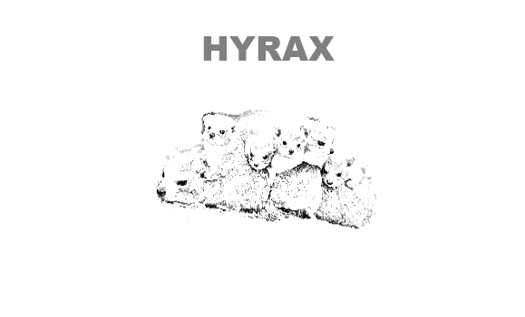

<link href="markdown.css" rel="stylesheet"/>

##Overview 

#####Hyrax is scala version of [Hystrix](https://github.com/Netflix/Hystrix/wiki) using scala Futures/Promises and Akka Actors/ActorSystems for the dependency resilience layer. It uses Akka IO for remote dependencies. It will only support web services initially and use spray to handle HTTP request/response. The spray Http client/service layer is built on top of akka IO. Any further protocols, such as ftp, jms or zeromq, will be implemented on top of Akka IO. Akka IO already supports tcp and udp.

#####Hyrax uses the [Akka Circuit Breaker](http://doc.akka.io/docs/akka/snapshot/common/circuitbreaker.html) to implement the scala equivalent of the Hystrix Circuit Breaker.

#####Hyrax uses Actors and their hierarchies to implement the bulkhead and swim-lane aspects of the resilience layer. [Actor supervision and monitoring](http://doc.akka.io/docs/akka/2.2.0-RC2/general/supervision.html) provide fault tolerance and fail-fast strategies.

#####Hystrix is a genus of porcupines, known for their protective ferocity: this is a good name for library that guarantees the resilience and safety of its dependents. [Hyrax](http://en.wikipedia.org/wiki/Hyracoidea) is a species of fairly small, thickset, herbivorous mammals who first appear in the fossil record at a site in the Middle East about 37 million years. They are very sociable, live in extended family units and are very protective of its young and other family members. Besides, they're related to elephants, who are known for their wisdom. *Hyrax* sounded like a good name for a scala Hystrix. Besides, they're cute - see picture above.

